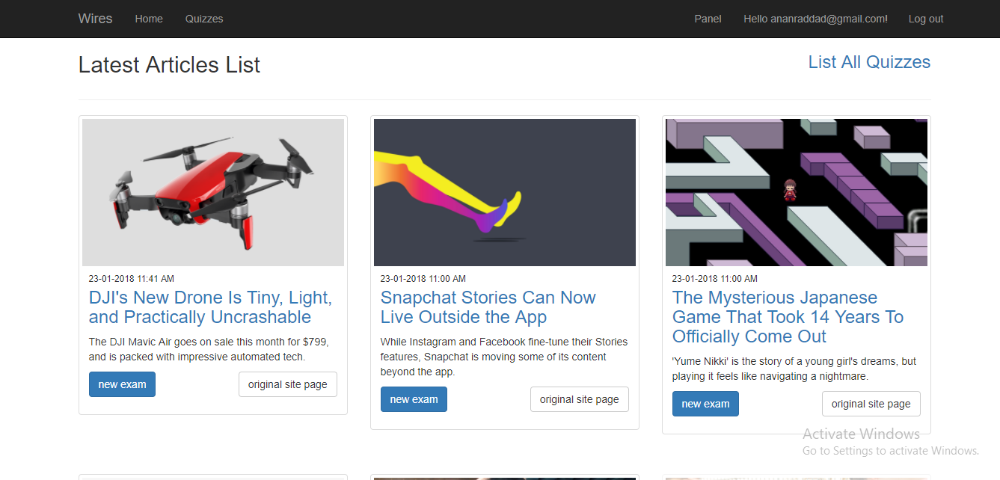
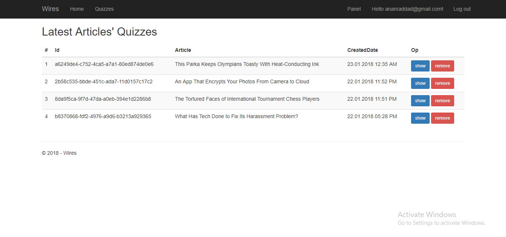
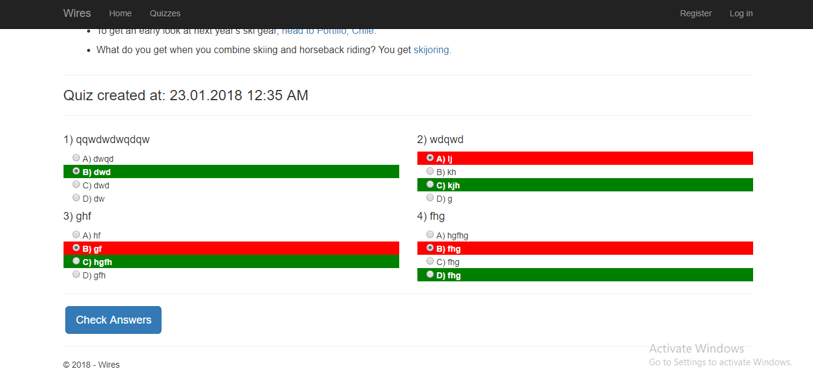

# Wires
konusrakogren.com test project

merhaba deneme yapýyorum

## Scenario

### Registered User
Create a user from register page, after that in the nav menu click on panel link `Panel/List` and you will have the list of the latest 5 articles from wired.com (parsing may take time), and other previous articles saved in the database will be shown dimmed.

Clicking any title there, will open the article page `Panel/QuizForArticle/{articleId}` with the text, and beneath that there is a space to write 4 questions as a quiz related to this article; if the article already has a quiz, questions will be shown and an option to delete the quiz will be provided.

After creating the quiz, in the `Panel/List` page, at the right upper corner, you can reach All Quizzes List `Panel/QuizList`.

At Quizzes list, a table will be shown, the quizzes and related article will be shown, the options to show or remove the quiz will be there too.

### Visitor User
Reading quizzes and enrolling in it is open for every visitor without registering, in the nav menu at the left side, Quizzes links will go to `Home/Quizzes`, which will show the list of quizzes created by registered users. 

Clicking a title there will show the quiz's article at `Home/ReadQuiz/{quizId}` and the quiz's questions at the bottom. After answering quiestons and clicking Check Answers button, it will send an a post request to `Api/QuizData/CheckAnswers`, the aftermath of this request will show the right and wrong answers asynchronously; providing instant feedback to the user.

## Details

Asp.net Core 2.0 project, using VisualStudio 2017.

- HTML parsing: HtmlAgilityPack.
- VisualStudio 2017 built-in Sql Server.
- Jquery and Boostrap.

## Notes

Real-life Project could be developed diffrentlly, with more complexity.
This is a test project.

